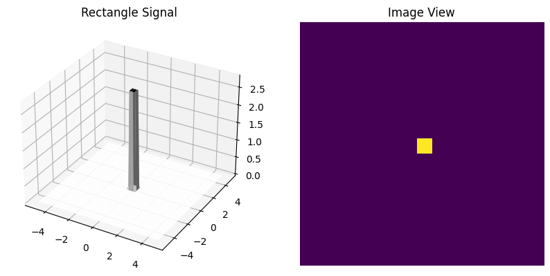
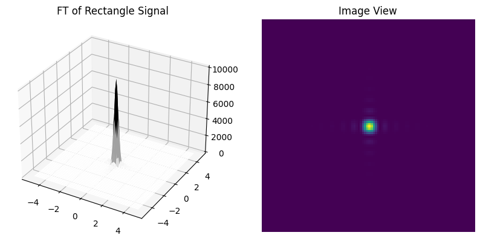
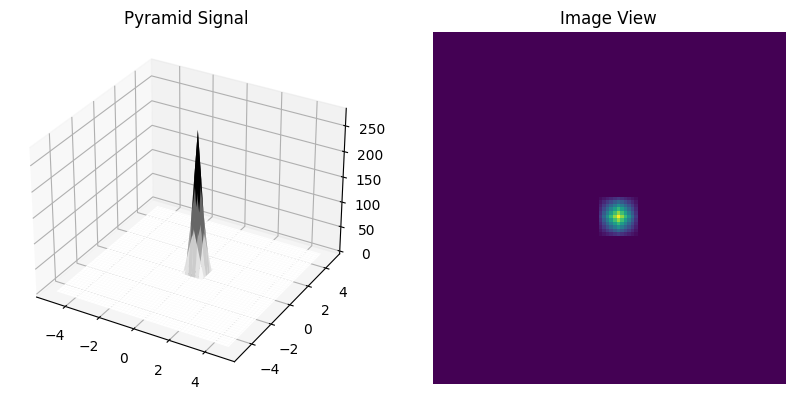
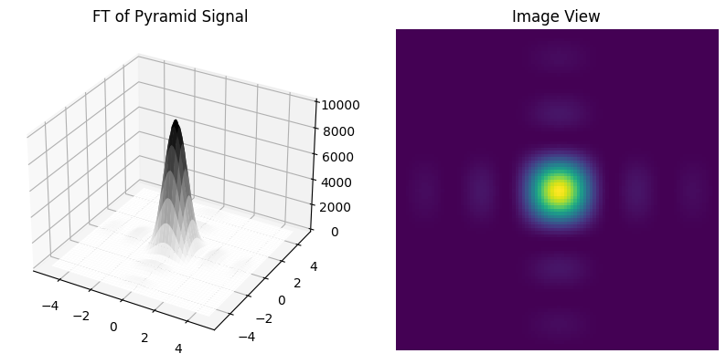
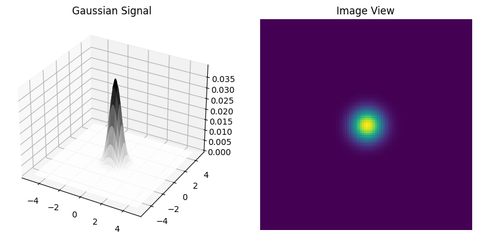
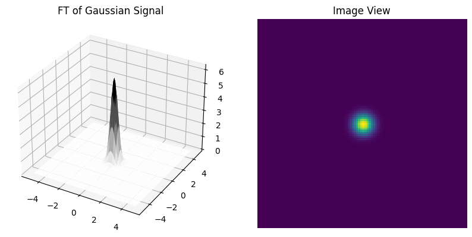
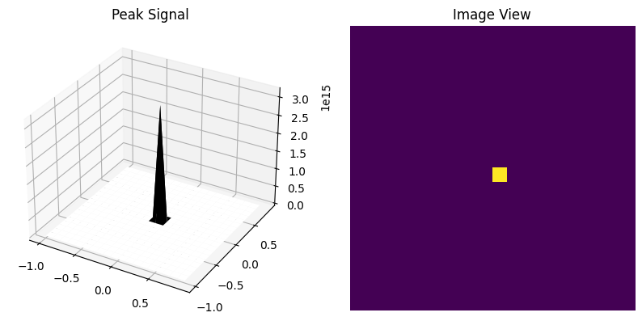
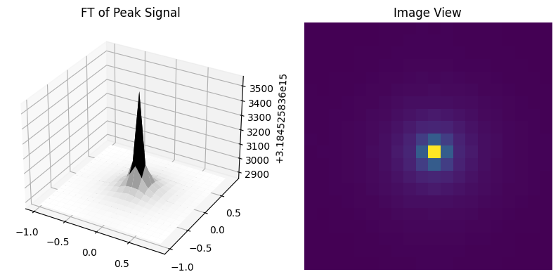
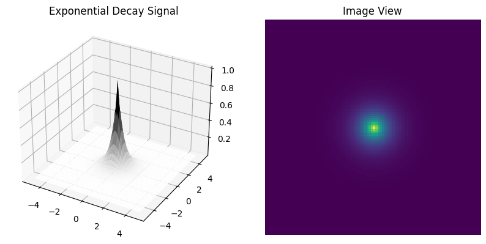

# plotting_serveral_singnals_with_their_fourier_transformation
This repo contains plot of several well-known functions with their Fourier Transform  

# Rectangle Signal

Original Signal Equation: 
$R_{a,b}(x,y) = \frac{1}{4ab}  u(a^2 - x^2) u (b^2 - y^2)$

where u is the step function, a and b are the parameters, width and height of the rectangle. And Fourier Transform Equation is:

$(\frac{sin(2\pi a f_x)}{\pi a f_x})(\frac{sin(2\pi b f_y)}{\pi b f_y})$

    
    

    

# Pyramid Signal

The Pyramid signal is the convolution of the Rectangle signal
$R_{a,b}(x,y) \circledast R_{a,b}(x,y)$

And the fourier transform of it is again the same but with power of 2

$\bigg( (\frac{sin(2\pi a f_x)}{\pi a f_x})(\frac{sin(2\pi b f_y)}{\pi b f_y})\bigg )^2$

    

    

# Gaussian Signal

$g_{2D}(r, \sigma) = \frac{1}{2 \pi \sigma^2} exp(-\frac{r^2}{2 \sigma^2})$

And its Fourier transform is:
    
$G_{2D}(f, \sigma) = exp(-2 \pi^2 f^2 \sigma^2)$

   

    

# Peak Signal

The equations for a signal called Peak is as

$\frac{1}{r}$

And The Fourier Transform of it is

$\frac{1}{f}$
 

    

# Exponential Decay Signal

The equation for this signal is
$e^{ar}$

And the fourier transform can be

$\frac{2 \pi a}{(w^2 + a^2)^{\frac{3}{2}}}$

   

    

